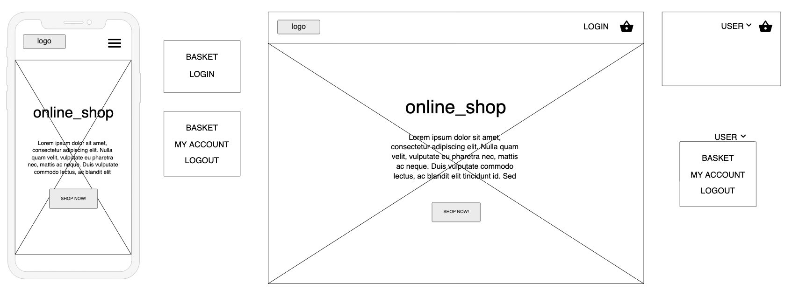
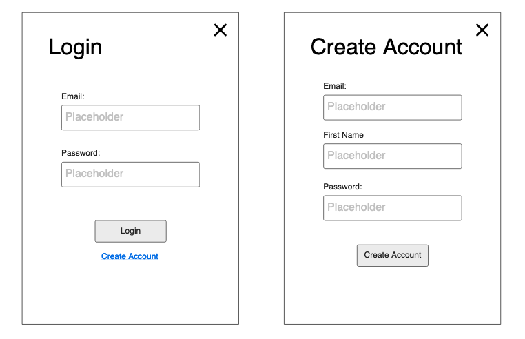
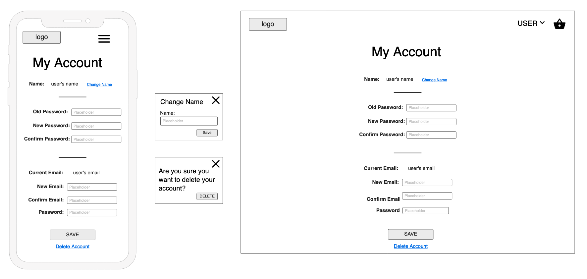
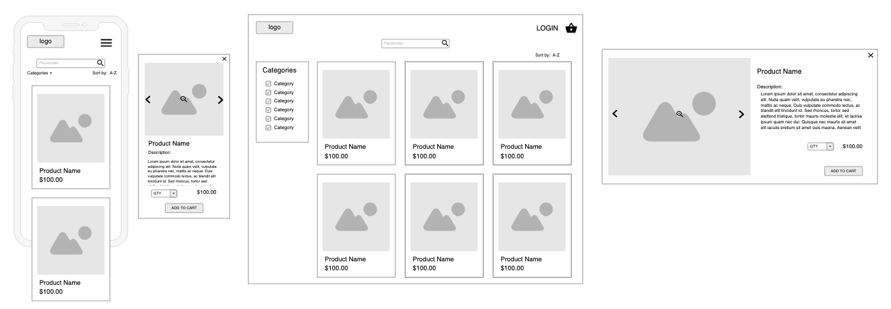
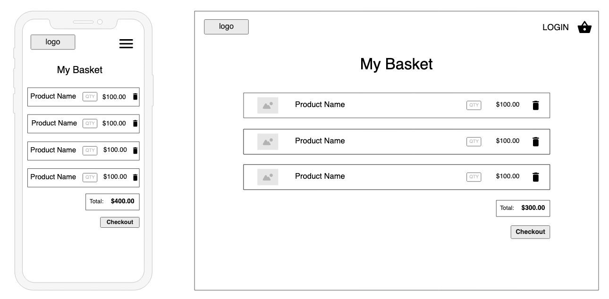
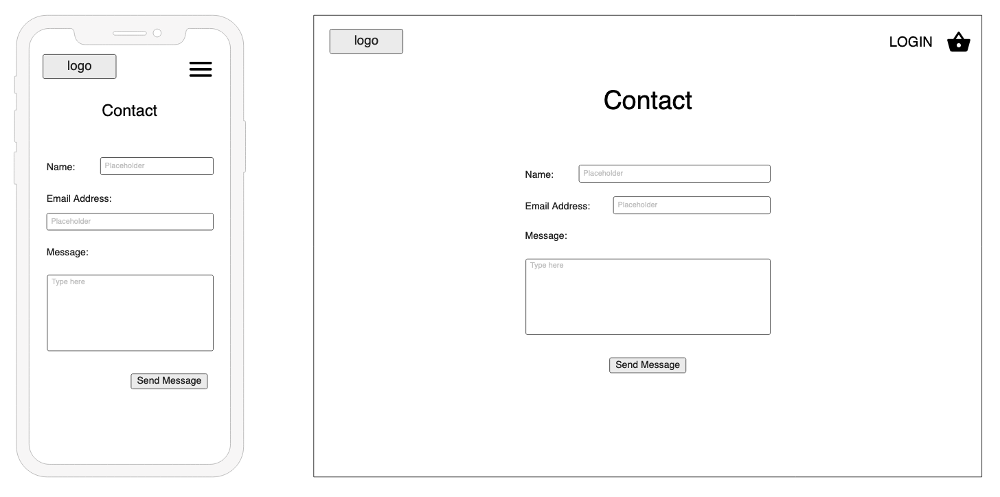
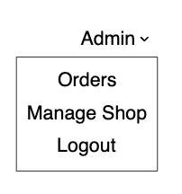
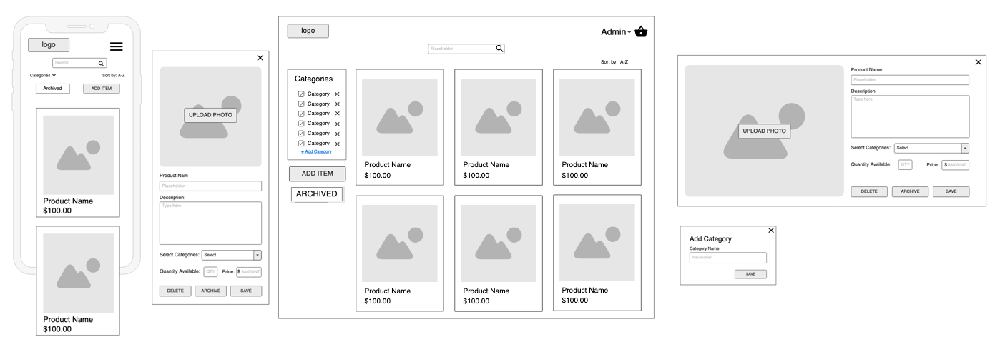
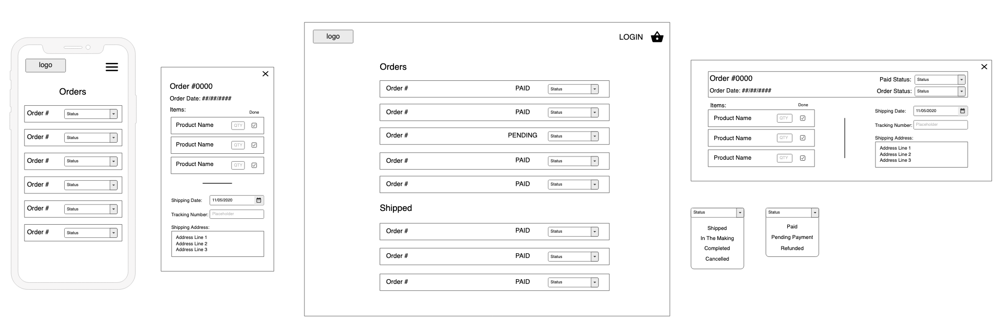
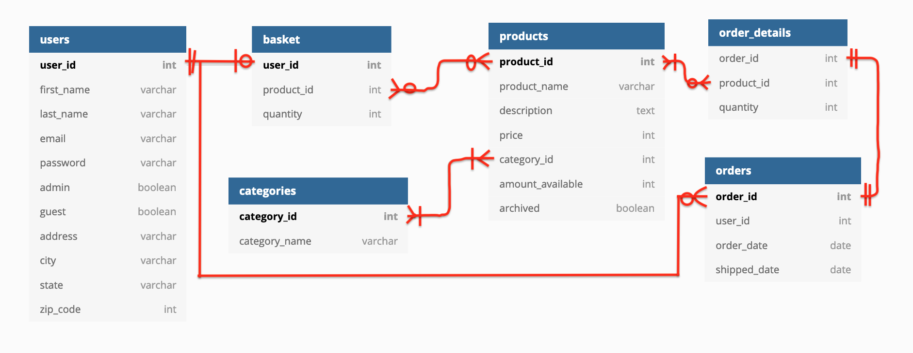

# online_shop

Trello Board: 

---

## Overview
This app will be an online shop for small business owners to sell their wares. The app will provide a user view point to buy items and a business owner viewpoint to upload and sell items. 
The user interface will be clear and simple, focusing on the items that the business owner is selling. The user will be able to create an account to track their purchases and keep items in their basket.  
The business owner (admin) interface will allow the owner to add, remove, and update the items for sale. There will be a page to view their orders and mark the status of the order to easily keep track. There will also be a page to track sales.

---

## Install Steps

You will need the latest version of python and the pip package manager to complete the installation steps. Once you have python and pip, the steps are as follows:

- Clone the repository: `git clone https://github.com/rheal3/receipt_app`
- Change directory into the repository: `cd receipt_app`
- Make sure venv is installed: `pip install venv`
- Create the virtual environment: `python3 -m venv venv`
- Activate the virtual environment: `source venv/bin/activate`
- Install the dependencies from requirments.txt: `pip3 install -r requirements.txt`
- Run the app: `python src/main.py`

---

## CI/CD

The CI/CD pipeline was created using Github Actions. It uses Python3.8, Pip3 and runs on the latest stable version of Ubuntu. The pipeline is started on a push to master.

Once it has pulled from master it installs the dependencies form requirements.txt and then it runs the tests in the tests directory.

---

## Wireframes

### Customer Interface

#### Landing Page
The landing page will have details about the business as well as photo's to entice the customer to continue further into the website.  
The background image will scroll through different product images with the business logo appearing ontop in the center of the page. By clicking on the logo on any page the user will be returned to the landing page.

#### Login/Create Account
The login/create account block appears above the current screen content on whichever page the user is on. This is the same popup for mobile and desktop.

#### My Account
The my account page will be a place for the customer to change their account information. By creating an account and logging in the customer will be able to come back to their basket items after leaving the website.

#### Shop
The shop page will contain 'item cards' that have images of the items for sale with the item name and price below. When the customer clicks on the item card a pop up will display (and the background will blur/become opaque) containing the item name, image, description, price, quantity, and an add to cart button.  
On the left hand of the page will be a category selection where the customer can choose the category of item they wish to browse. There will also be a sorting button to sort A-Z, Z-A, or by price.

#### Basket/Cart
The cart page will display the items that the customer has selected and give the customer options to remove, change quantity, or proceed to checkout.

#### Checkout
The checkout page will take the customers details and securely checkout their purchase. The customer will receive an order number and receipt.

#### Contact
The contact page will have a simple for the customer can fill out providing their name, email, subject and message that will be sent through email to the business owner.
 

### Admin Interface
The admin will be able to view and access the customer interface in the same manner as the customers, however in the drop down after logging in they have options for: managing the shop and orders.  

#### Manage Shop
When the admin clicks on an item card the same pop up will appear, but will fields for editing. There will be extra fields for the category of the item and the admin will be able to save, delete, or archive the item card. The admin can access archived items through the archive tab under the add item tab on the left hand side. They will also be able to add categories on the left hand side at the bottom of the categories list.

#### Orders
Orders will be ordered by order id. There will be a filtering option to filter by order status. When the admin clicks on the order it will show which items have been ordered, when, and the quantity; whether the customers payment has been received; and the shipping details. The admin will be able to change the status of the order within this popup.

<!-- #### Statistics -->
<!-- Currently unsure about what statistics are important... -->
<!--  -->

<!-- #### Customers -->
<!-- This page will list all customers who have made accounts and allow the admin to send a password reset email to the customer. ??? -->
<!--  -->

---

## Database Schema

- customer many or zero orders, orders one and only one customer

- basket zero or one users, users one and only one basket

- product many or zero orders, orders many or one product

- category many or one product, product many or one category

- basket many or zero products, products many or zero baskets

- order_details one and only one order, orders one and only one order_details
- order_details many or one product, product many or zero order_details

---

## Swagger

The swagger file shows the endpoints that will be used in the application. The endpoints include: shop, user, and orders.

The swagger file is located at `.github/swagger.yml`. To view, it can be uploaded to https://editor.swagger.io/# or viewed in the terminal using the `less` or `cat` commands.

